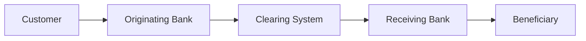

# Message Architecture

ISO 20022 uses structured XML-based messaging formats.

## High-Level Architecture

## Common Message Types

| Message  | Description              |
| -------- | ------------------------ |
| pacs.008 | Customer Credit Transfer |
| pacs.009 | FI to FI Transfer        |
| pain.001 | Payment Initiation       |
| pain.008 | Direct Debit             |
| camt.053 | Account Statement        |

## Message Components

* Header
* Debtor Information
* Creditor Information
* Remittance Data
* Settlement Details

## Benefits of Rich Data

ISO 20022 supports significantly more information than legacy message formats.
