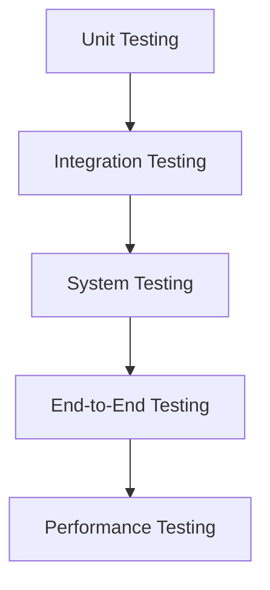

# Testing Strategy

Testing is one of the most critical components of any ISO 20022 migration program.

## Testing Pyramid

## Key Validation Areas

### Schema Validation

Verify message compliance with ISO schemas.

### Business Rule Validation

Ensure business processes are supported.

### Integration Testing

Validate interactions between systems.

### End-to-End Testing

Verify complete payment journeys.

### Performance Testing

Validate high-volume transaction processing.

## Test Data Requirements

* Positive Scenarios
* Negative Scenarios
* Boundary Conditions
* Regulatory Cases
