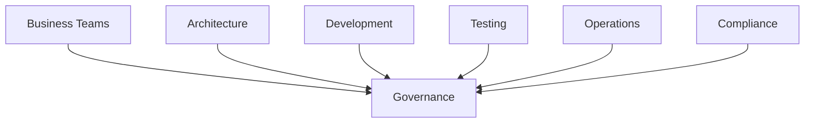

# Governance

Successful ISO 20022 programs require strong governance.

## Stakeholder Model

## Responsibilities

| Team         | Responsibility       |
| ------------ | -------------------- |
| Business     | Requirements         |
| Architecture | Solution Design      |
| Development  | Implementation       |
| Testing      | Validation           |
| Operations   | Deployment           |
| Compliance   | Regulatory Oversight |

## Governance Principles

* Accountability
* Transparency
* Compliance
* Risk Management
* Continuous Improvement
